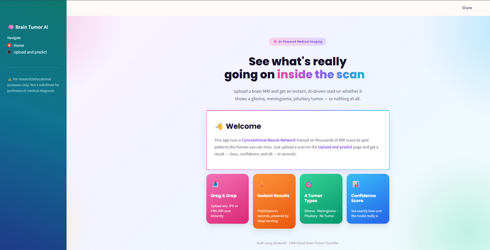
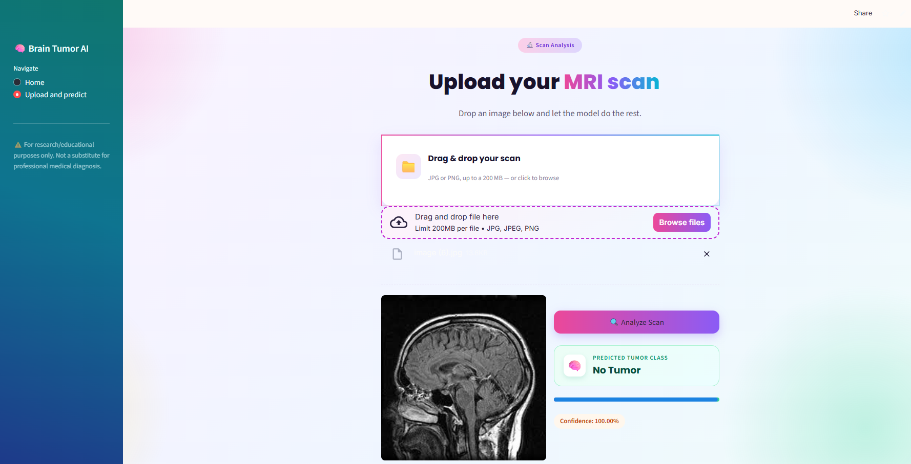
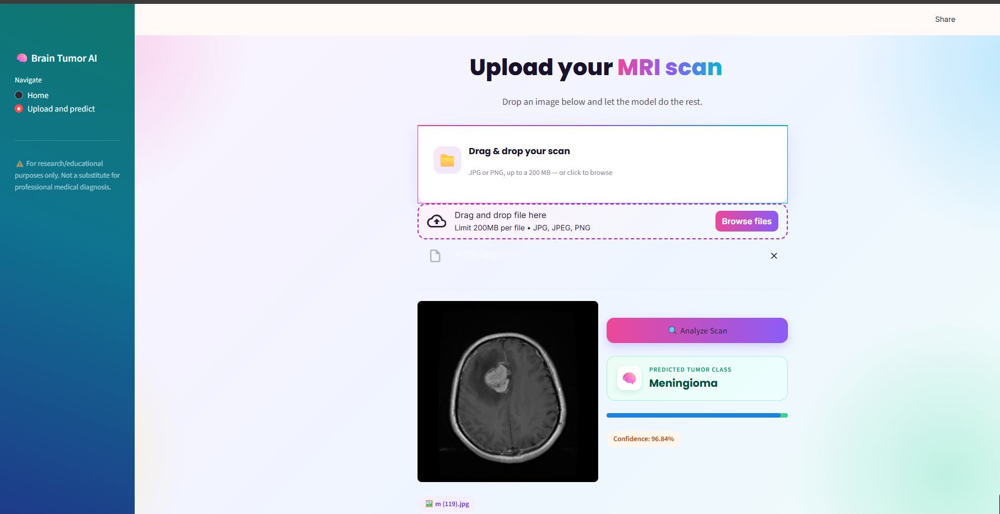

<div align="center">

# 🧠 Brain Tumor Classification using CNN

### Deep Learning powered Brain MRI Tumor Detection & Classification


[](https://brain-tumor-classification-bmnjnasr2wt6bqzzvcymig.streamlit.app/)
[](https://github.com/sriharshith-2006/Brain-Tumor-Classification)
[](https://github.com/sriharshith-2006)

</div>

---

## 📖 Table of Contents

- [Overview](#-overview)
- [Live Demo](#-live-demo)
- [Features](#-features)
- [Tumor Classes](#-tumor-classes)
- [Project Structure](#️-project-structure)
- [CNN Architecture](#️-cnn-architecture)
- [Tech Stack](#️-tech-stack)
- [Dataset](#-dataset)
- [Model Pipeline](#-model-pipeline)
- [Model Evaluation](#-model-evaluation)
- [Installation](#-installation)
- [Deployment](#-deployment)
- [Screenshots](#-screenshots)
- [Requirements](#-requirements)
- [Future Improvements](#-future-improvements)
- [Disclaimer](#️-disclaimer)
- [Author](#-author)
- [Support](#-support)
- [License](#-license)

---

## 📌 Overview

**Brain Tumor Classification** is an end-to-end Deep Learning project that automatically classifies Brain MRI scans into one of **four categories** using a Convolutional Neural Network (CNN).

The application ships with an interactive **Streamlit** interface — upload an MRI image and instantly get back the predicted tumor class along with the model's confidence score.

This project demonstrates a complete Deep Learning workflow:

> `Data Preprocessing` → `CNN Development` → `Training` → `Evaluation` → `Prediction` → `Web App` → `Cloud Deployment`

---

## 🚀 Live Demo

<div align="center">

[](https://brain-tumor-classification-bmnjnasr2wt6bqzzvcymig.streamlit.app/)

### 🌐 [Try the App on Streamlit →](https://brain-tumor-classification-bmnjnasr2wt6bqzzvcymig.streamlit.app/)

</div>

---

## 🎯 Features

| | |
|---|---|
| 🧠 **Brain MRI Classification** | Classifies scans into 4 tumor categories |
| 📤 **Drag & Drop Upload** | Upload any JPG/PNG MRI scan instantly |
| ⚡ **Instant Predictions** | Results delivered in seconds |
| 📊 **Confidence Score** | See exactly how sure the model is |
| 🎨 **Modern UI** | Clean, gradient-based Streamlit interface |
| 📱 **Responsive Design** | Works smoothly across screen sizes |
| ☁️ **Cloud Deployment** | Live and hosted on Streamlit Cloud |
| 🔄 **Auto Model Download** | Fetches trained weights from Google Drive |
| 💻 **CPU Compatible** | No GPU required for inference |

---

## 🧠 Tumor Classes

<div align="center">

| Class | Description |
|:---:|:---|
| 🔴 **Glioma** | Tumor arising from glial cells in the brain/spine |
| 🟠 **Meningioma** | Tumor forming in the meninges (brain's protective layers) |
| 🟢 **No Tumor** | Healthy scan with no detected tumor |
| 🔵 **Pituitary** | Tumor forming in the pituitary gland |

</div>

---

## 🏗️ Project Structure

```text
Brain-Tumor-Classification/
│
├── app.py                  # Streamlit application
├── model.py                 # CNN Architecture
├── train.py                  # Model Training
├── test.py                   # Model Evaluation
├── predict.py                 # Prediction Script
│
├── outputs/
│   ├── confusion_matrix.png
│   └── classification_report.txt
│
├── predicted_images/
│   └── predictions.png
│
├── assests/
│   ├── home.png
│   ├── example1.png
│   ├── example2.png
│   └── random 10 test samples.png
│
├── requirements.txt
├── runtime.txt
├── .gitignore
├── README.md
│
└── saved_models/
    └── best_model.pth      # Downloaded automatically from Google Drive
```

---

## 🏛️ CNN Architecture

The model is built from the following deep learning layers, stacked to progressively extract spatial features from MRI scans:

```
Input (224×224×3)
   │
   ├── Convolution Layers
   ├── Batch Normalization
   ├── ReLU Activation
   ├── Max Pooling
   ├── Dropout
   ├── Fully Connected Layers
   └── Softmax Output Layer
   │
Output (4 Classes)
```

---

## ⚙️ Tech Stack

<div align="center">

| Category | Tools |
|---|---|
| **Language** | Python |
| **Deep Learning** | PyTorch, Torchvision |
| **Web Framework** | Streamlit |
| **Data Processing** | NumPy, Pandas |
| **Visualization** | Matplotlib |
| **Image Processing** | Pillow, OpenCV |
| **Model Delivery** | Google Drive, gdown |

</div>

---

## 📊 Dataset

The project uses a **Brain MRI image dataset** spanning four classes:

- Glioma
- Meningioma
- No Tumor
- Pituitary

**Image Size:** All MRI scans are resized to `224 × 224` before being passed to the CNN model.

---

## 🧪 Model Pipeline

```text
Brain MRI Image
        │
        ▼
   Image Upload
        │
        ▼
 Resize (224×224)
        │
        ▼
 Tensor Conversion
        │
        ▼
     CNN Model
        │
        ▼
   Softmax Layer
        │
        ▼
Predicted Tumor Class
        │
        ▼
  Confidence Score
```

---

## 📈 Model Evaluation

The trained model was evaluated on a held-out **test dataset**, measuring:

- ✅ Classification Accuracy
- ✅ Prediction Confidence
- ✅ Confusion Matrix

**Example prediction output:**

```
Prediction : Glioma
Confidence : 98.74%
```

### 🔍 Predictions on Random Test Samples

Below are predictions made by the trained model on **10 randomly sampled images from the test dataset**, showing the actual label vs. the predicted label along with the confidence score for each.

<div align="center">

</div>

> The model correctly predicts most samples with high confidence — including harder cases across different MRI orientations (sagittal, axial, coronal) and even a non-MRI CT scan.

---

## 📦 Installation

**1. Clone the repository**

```bash
git clone https://github.com/sriharshith-2006/Brain-Tumor-Classification.git
```

**2. Move into the project folder**

```bash
cd Brain-Tumor-Classification
```

**3. Install dependencies**

```bash
pip install -r requirements.txt
```

**4. Run the application**

```bash
streamlit run app.py
```

> The trained model will be downloaded automatically on first run.

---

## 🌐 Deployment

The application is deployed on **Streamlit Community Cloud**.

Since GitHub enforces a 100 MB file size limit, the trained model (`best_model.pth`) is **not stored in the repository**. Instead, the app automatically downloads it from **Google Drive** via `gdown` when it starts up.

---

## 📸 Screenshots

### 🏠 Home Page

The landing page introduces the app and highlights its core features — drag & drop upload, instant results, the four supported tumor classes, and confidence scoring.

<div align="center">

</div>

---

### 📤 Upload & Predict — Example 1 · No Tumor

A sagittal MRI scan uploaded and analyzed by the model — correctly predicted as **No Tumor** with **100.00% confidence**.

<div align="center">

</div>

---

### 📤 Upload & Predict — Example 2 · Meningioma

An axial MRI scan uploaded and analyzed by the model — correctly predicted as **Meningioma** with **96.84% confidence**.

<div align="center">

</div>

---

## 💻 Requirements

```
torch==2.7.1
torchvision==0.22.1
streamlit==1.49.1
numpy==2.2.6
pandas==2.3.2
matplotlib==3.10.6
scikit-learn==1.7.2
pillow==11.3.0
opencv-python-headless==4.12.0.88
gdown==5.2.0
```

---

## 🚀 Future Improvements

- [ ] Grad-CAM Visualization
- [ ] Better CNN Architecture
- [ ] Faster Inference
- [ ] Batch Image Prediction
- [ ] REST API using FastAPI
- [ ] Docker Deployment
- [ ] Mobile Responsive Interface
- [ ] Model Quantization
- [ ] Multi-language Support

---

## ⚠️ Disclaimer

This application is intended for **educational and research purposes only**.

It should **not** be used as a substitute for professional medical diagnosis or clinical decision-making. Always consult qualified healthcare professionals for medical advice.

---

## 👨‍💻 Author

<div align="center">

### Sriharshith Janga

**B.Tech – Artificial Intelligence and Data Science**
**IIIT Sri City**

[](https://github.com/sriharshith-2006)

</div>

---

## ⭐ Support

If you found this project useful, please consider giving this repository a **⭐ on GitHub**.

It helps others discover the project and supports future improvements.

---

## 📄 License

This project is licensed under the **MIT License**.

Feel free to use, modify, and distribute it for educational and research purposes.
